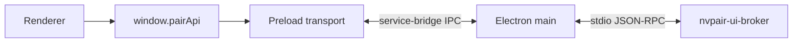

<!--
SPDX-FileCopyrightText: Copyright (c) 2026 NVIDIA CORPORATION & AFFILIATES. All rights reserved.
SPDX-License-Identifier: Apache-2.0
-->

# Frontend API

The supported renderer service API is `window.pairApi`. It is available only in
Electron and is backed by the preload service bridge.

The source of truth is:

- `src/shared/types/ws-channels.ts` for logical invoke and push channels;
- `src/ui/api/pair-api.ts` for the renderer-facing API;
- `src/shared/types/ipc-channels.ts` for Electron-native IPC.

## Transport

`WsInvokeChannelMap` and `WsPushChannelMap` describe logical service messages.
They do not imply a WebSocket connection. Browser clients are not supported.

## Renderer API

### `pairApi.app`

- `getInitial()` returns connection state and the local node ID.

### `pairApi.connection`

- `onStateRequestRefresh(callback)` requests a fresh domain snapshot.
- `onClusterIdentity(callback)` reports local cluster identity changes.

### `pairApi.nodes`

- `getInitial()` returns the current node map and fetch status.
- `removeMember(nodeId)` removes a cluster member.
- `onUpsert(callback)` reports node additions and updates.
- `onRemove(callback)` reports node removals.
- `onMembersChanged(callback)` reports a complete membership snapshot.

### `pairApi.cluster`

- `getInitial()` returns identity, settings, membership, and all live inbound invites.
- `inviteNode(ipAddress)` starts PIN pairing.
- `inviteStatus(inviteId)` polls an outbound pairing session.
- `respondToInvite(inviteId, accept, pin?)` accepts or declines an invite.
- `cancelInvite(inviteId)` cancels an in-flight outbound invite, invalidating its
  PIN backend-side and notifying the joiner.
- `abandonIfSolo()` removes a cluster created only for an unsuccessful invite.
- `onInviteReceived(callback)` reports a freshly-arrived inbound pairing request.
- `onPendingInvitesChanged(callback)` reports the full authoritative set of live inbound invites (re-emitted on every add or prune).

### `pairApi.discovery`

- `getNodes()` returns discoverable nodes. Each `AvailableNode` carries the
  backend `id` (the stable per-host UUID that keys every domain), the display
  `name` (hostname), the reachable `ipAddress`/`port`, and the `trusted` and
  `clustered` flags. A `clustered` node already belongs to some cluster and is
  rendered non-invitable.
- `onNodesChanged(callback)` reports discovery changes.

### `pairApi.engines`

- `getInitialState()` returns engine statuses, models, active progress, and available
  updates.
- `toggle`, `install`, `uninstall`, and `update` manage engine lifecycle.
- `pullModel`, `loadModel`, `unloadModel`, `deleteModel`, and
  `setModelExpiry` manage models.
- `searchHub(engineType)` returns the curated model catalog for an engine.
- `onStateChanged`, `onProgress`, and `onProgressRemove` expose backend truth.
- `getSettings(target)` reads the owning node's authoritative settings snapshot
  (server port, proxy port, engine arguments) for one engine.
- `previewSettings(request)` validates a draft against the owner without
  persisting or touching a process, returning normalized settings, per-field
  errors, any port conflict, and whether applying restarts or rebinds.
- `applySettings(request)` commits a draft and waits for the owner's stop,
  rebind, and restart/readiness operation before returning its receipt. This
  can take minutes (Ollama permits ten minutes for readiness; the desktop call
  allows fourteen minutes). The receipt identifies the accepted operation;
  use `onSettingsChanged` for its authoritative applied or failed state. Once
  durably accepted, the owner continues even if the caller disconnects or
  loses the response; reload the snapshot before retrying.
- `onSettingsChanged(callback)` reports a settings snapshot for any node — the
  only source of applied settings state.
- `onSettingsDisconnected(callback)` reports that a node's settings authority
  became unreachable, so its cached snapshot is stale.

Port and launch changes work on a clustered peer as well as the local device,
with one exception: **managed CORS origin settings** are local-only. The owning
node rejects a change to browser access policy relayed from a peer. Other
environment assignments pass through without an engine-option catalog.

`EngineCommandPayload.command` supports:

- `toggle`;
- `install`;
- `installAll`;
- `uninstall`;
- `update`;
- `pullModel`;
- `loadModel`;
- `unloadModel`;
- `deleteModel`;
- `setModelExpiry`.

Commands return no state. Renderer stores update from
`engines:state-changed`, `engines:progress-changed`, and
`engines:progress-cleared`.

### `pairApi.workloads`

- `getInitial()` returns active workloads.
- `onUpsert(callback)` reports workload creation and state changes.
- `onRemove(callback)` reports removal with both workload ID and origin node.

### `pairApi.errors`

- `getInitial()` returns active service errors.
- `clear(id)` dismisses an error.
- `onUpdate(callback)` reports the complete current error list.

### `pairApi.metrics`

- `onUpdate(callback)` reports node CPU, memory, GPU, and VRAM metrics.

## Logical invoke channels

| Channel                     | Request                      | Response                  |
| --------------------------- | ---------------------------- | ------------------------- |
| `app:get-initial`           | `void`                       | `AppInitialSnapshot`      |
| `nodes:get-initial`         | `void`                       | node map and fetch status |
| `nodes:remove-member`       | `{ nodeId }`                 | `{ nodeId, removed }`     |
| `discovery:get-nodes`       | `void`                       | `AvailableNode[]`         |
| `cluster:get-initial`       | `void`                       | `ClusterInitialSnapshot`  |
| `cluster:invite-node`       | `{ ipAddress }`              | `Invite`                  |
| `cluster:invite-status`     | `{ inviteId }`               | `Invite`                  |
| `cluster:respond-to-invite` | `{ inviteId, accept, pin? }` | `Invite`                  |
| `cluster:cancel-invite`     | `{ inviteId }`               | `Invite`                  |
| `cluster:abandon-if-solo`   | `void`                       | `null`                    |
| `engines:get-initial`       | `void`                       | `EngineInitialState`      |
| `engines:get-settings`      | `EngineSettingsTarget`       | `EngineSettingsSnapshot`  |
| `engines:preview-settings`  | `EngineSettingsRequest`      | `EngineSettingsPreview`   |
| `engines:apply-settings`    | `EngineSettingsRequest`      | `EngineSettingsReceipt`   |
| `engine:command`            | `EngineCommandPayload`       | `null`                    |
| `engine:search-hub`         | `{ engineType }`             | `EngineHubSearchResponse` |
| `errors:get-initial`        | `void`                       | `ServiceError[]`          |
| `errors:clear`              | error ID                     | `null`                    |
| `workloads:get-initial`     | `void`                       | workload map              |

## Logical push channels

| Channel                           | Payload                          |
| --------------------------------- | -------------------------------- |
| `nodes:upsert`                    | `NodeItem`                       |
| `nodes:remove`                    | node ID                          |
| `nodes:changed`                   | `ClusterNode[]`                  |
| `engines:state-changed`           | `EngineStatePatch`               |
| `engines:settings-changed`        | `EngineSettingsSnapshot`         |
| `engines:settings-disconnected`   | `{ nodeId }`                     |
| `engines:progress-changed`        | `EngineProgress`                 |
| `engines:progress-cleared`        | `{ key }`                        |
| `metrics:update`                  | `NodeItemMetrics`                |
| `workloads:upsert`                | `Workload`                       |
| `workloads:remove`                | `{ workloadId, originatedFrom }` |
| `errors:update`                   | `ServiceError[]`                 |
| `cluster:invite-received`         | `Invite`                         |
| `cluster:pending-invites-changed` | `Invite[]`                       |
| `discovery:nodes-changed`         | `AvailableNode[]`                |
| `connection:cluster-identity`     | `ClusterIdentityPayload`         |
| `state:request-refresh`           | `void`                           |

## Electron-native API

`window.windowApi` covers operations that require Electron main:

- window, tray, and clipboard operations;
- service start, stop, restart, status, logging, versions, and licenses;
- first-run completion;
- wipe all PAIR-owned app data (`getWipePlan()` / `wipeAppData()` — packaged builds
  stop, delete, and relaunch; unpackaged builds stop, delete, and quit with a
  prompt to restart manually);
- update check, download, install, and status;
- the node-local Inference Demo (`inferenceDemo.getState()` / `start()` / `stop()`
  and the `demo:state` push). `start()` rejects if a demo is already running on
  this node or if no local engine exposed a text-generation model; callers show
  that as an ordinary error banner. Demo state is not synchronized across nodes.

`demo:state` is a main-to-renderer broadcast rather than a service push, so it is
typed in `IpcPushChannelMap` (`shared/types/ipc-channels.ts`) instead of the
logical push table above.

Service status remains `connecting` until both the broker and required Ollama
proxy report ready. `ServiceStatus.error` carries the latest startup or runtime
failure; successful readiness and deliberate stops clear it, which is how a
crash is told apart from a stop the user asked for.

The `service:status` broadcast is the only signal that separates a stopped
service from a slow-starting one, because the service bridge cannot report its
own absence. Overview and the tray read it through `service-status.store.ts` and
show a stopped state with a Start control rather than an open-ended spinner, and
the renderer re-reads every snapshot when the connector returns to `connected`.

Every invoke is declared in `IpcChannelMap` and handled through `safeHandle()`.
IPC responses use the typed `IpcResult<T>` envelope.

## Subscription lifecycle

Every subscription returns an unsubscribe callback. Stores and components must
call it during teardown. Initial snapshots should be fetched before or alongside
subscription setup so a renderer reload reconstructs state from the service.

## Local HTTP

An inference feature may use engine HTTP endpoints as a local third-party
client. Those requests are separate from the renderer control API and do not
replace `window.pairApi`. Nothing in the renderer does this today.
