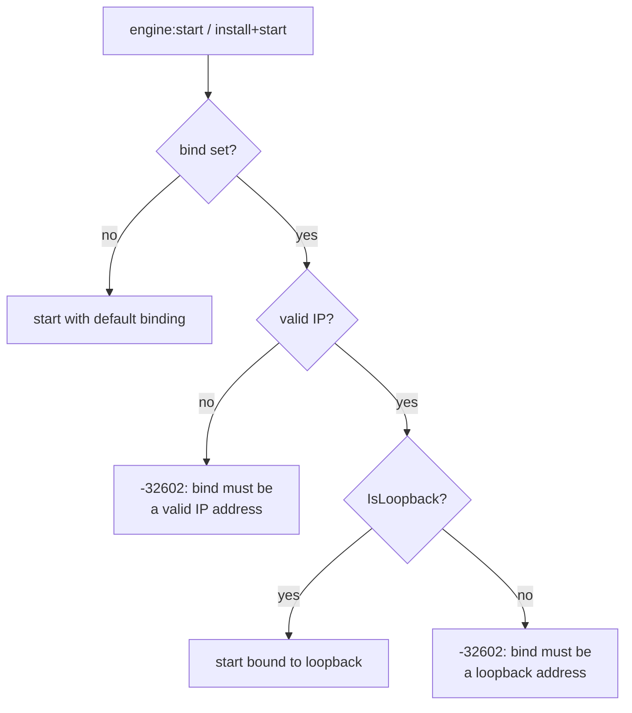

{/*
SPDX-FileCopyrightText: Copyright (c) 2026 NVIDIA CORPORATION & AFFILIATES. All rights reserved.
SPDX-License-Identifier: Apache-2.0
*/}

# Engine bind validation

`services/nvpair-engine-manager` starts and installs inference engines on
behalf of the broker. Engine APIs (Ollama, LM Studio) are unauthenticated, so
the address they bind to is the entire access control. This document covers
the fix that keeps local engine starts on loopback.

## The problem

`engine:start` (and install-then-start) accepted a `bind` parameter that was
validated only as a well-formed IP address. Any valid IP passed — including
`0.0.0.0`:

```json
{"method": "engine:start", "params": {"engine": "ollama", "bind": "0.0.0.0"}}
```

That silently exposed the engine's unauthenticated API to the whole LAN. The
remote-start path already hard-binds `127.0.0.1`
(`controllifecycle.go`), so local starts were the inconsistent, weaker case:
the same engine, the same API, bound to every interface on the machine.

## The fix

`runOp` now requires a loopback address for `bind`:

- `""` (unset) keeps the previous default behavior — the engine binds as the
  executor configures it.
- A non-loopback address (`0.0.0.0`, `192.168.1.5`, `::`, …) is rejected with
  JSON-RPC `-32602` and the message `bind must be a loopback address`.
  Nothing is started.
- An unparseable value is still rejected as before with `bind must be a valid
  IP address`.
- Loopback addresses (`127.0.0.1`, `::1`) pass validation and reach the
  executor unchanged.



If a deployment genuinely needs an engine reachable beyond loopback, that is
a product decision for the engine's own configuration — not something a
broker caller should be able to opt into per start.

## Validation

- `bind_validation_test.go` drives `runOp` directly: `0.0.0.0`,
  `192.168.1.5`, and `::` are rejected; `not-an-ip` is rejected as invalid;
  `127.0.0.1` and `::1` pass validation. Run with
  `go test -race ./...` from `services/nvpair-engine-manager`.
- Component version bumped per `services/VERSIONING.md`:
  `nvpair-engine-manager` 0.17.4 → 0.17.5.
