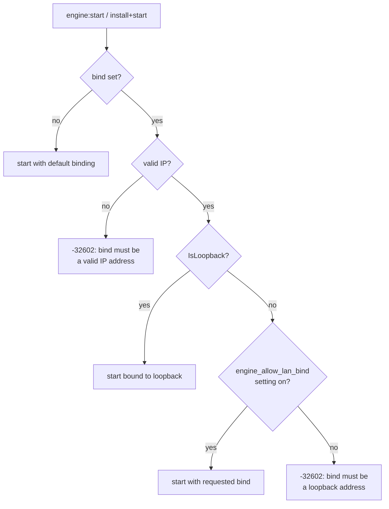

{/*
SPDX-FileCopyrightText: Copyright (c) 2026 NVIDIA CORPORATION & AFFILIATES. All rights reserved.
SPDX-License-Identifier: Apache-2.0
*/}

# Engine bind validation

`services/nvpair-engine-manager` starts and installs inference engines on
behalf of the broker. Engine APIs (Ollama, LM Studio) are unauthenticated, so
the address they bind to is the entire access control. This document covers
the fix that keeps local engine starts on loopback by default, with a
deliberate opt-in for operators who want more.

## The problem

`engine:start` (and install-then-start) accepted a `bind` parameter that was
validated only as a well-formed IP address. Any valid IP passed — including
`0.0.0.0`:

```json
{"method": "engine:start", "params": {"engine": "ollama", "bind": "0.0.0.0"}}
```

That silently exposed the engine's unauthenticated API to the whole LAN. The
remote-start path already hard-binds `127.0.0.1`
(`controllifecycle.go`), so local starts were the inconsistent, weaker case:
the same engine, the same API, bound to every interface on the machine.

## The fix

`runOp` requires a loopback address for `bind`, unless the operator has
opted in through the `engine_allow_lan_bind` node setting:

- `""` (unset) keeps the previous default behavior — the engine binds as the
  executor configures it.
- A non-loopback address (`0.0.0.0`, `192.168.1.5`, `::`, …) is rejected with
  JSON-RPC `-32602` and the message `bind must be a loopback address`.
  Nothing is started.
- An unparseable value is still rejected as before with `bind must be a valid
  IP address`.
- Loopback addresses (`127.0.0.1`, `::1`) pass validation and reach the
  executor unchanged.


```mermaid
flowchart TD
    A[engine:start / install+start] --> B{bind set?}
    B -->|no| C[start with default binding]
    B -->|yes| D{valid IP?}
    D -->|no| E[-32602: bind must be<br/>a valid IP address]
    D -->|yes| F{IsLoopback?}
    F -->|yes| G[start bound to loopback]
    F -->|no| H{engine_allow_lan_bind<br/>setting on?}
    H -->|yes| I[start with requested bind]
    H -->|no| J[-32602: bind must be<br/>a loopback address]
```

## Opting in to LAN binds

PAIR defaults to safe and stays out of the operator's way: if a deployment
genuinely needs an engine reachable beyond loopback, flip the
`engine_allow_lan_bind` node setting:

```json
{"jsonrpc":"2.0","id":1,"method":"settings/set-engine-allow-lan-bind","params":{"value": true}}
```

The setting is read live on every start, so no restart is needed. It is
deliberately a node-level switch rather than a per-call flag: opening an
unauthenticated API to the LAN should be a conscious, persistent decision
about the machine, not something a single broker call can slip in. Turning
it back off takes effect on the next start as well.

## Validation

- `bind_validation_test.go` drives `runOp` directly with the setting stubbed
  both ways: with it off, `0.0.0.0`, `192.168.1.5`, and `::` are rejected;
  `not-an-ip` is rejected as invalid; `127.0.0.1` and `::1` pass. With it
  on, every well-formed bind passes and only unparseable values are
  rejected. Run with `go test -race ./...` from
  `services/nvpair-engine-manager`.
- `nvpair-node-settings` covers the new get/set methods with a round-trip
  test: default false, set true reads back true, set false reads back false.
- Component bumps declared in the PR's release-intent block
  (`nvpair-engine-manager: patch`, `nvpair-node-settings: patch`,
  `nvpair-ui-broker: patch`); `services/versions.json` is
  automation-managed per `services/VERSIONING.md`.
