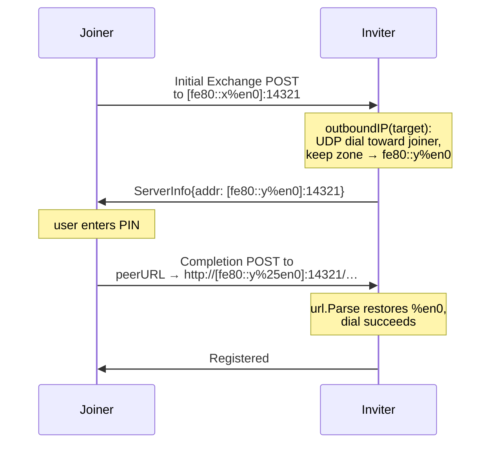

{/*
SPDX-FileCopyrightText: Copyright (c) 2026 NVIDIA CORPORATION & AFFILIATES. All rights reserved.
SPDX-License-Identifier: Apache-2.0
*/}

# Pairing over IPv6 link-local

Pairing failed after the PIN was accepted when the inviter had been reached
over an IPv6 link-local address (`fe80::/10`): the joiner's Completion
Exchange POST went to the inviter's address **without its scope zone**
(`[fe80::…]:14321`), which has no route, so the exchange died with
`connect: no route to host` and the invite flipped to `failed`.

Two defects combined to produce this. Both are fixed.

## 1. The scope zone was dropped when the inviter advertised its address

The inviter tells the joiner where to POST the Completion Exchange via the
`addr` field of its `PairingInfo` (carried in the EAP-NOOB ServerInfo and
covered by the transcript MACs). It computes that address with `outboundIP`:
dial a UDP socket toward the joiner and read back the local address.

`net.UDPAddr.IP.String()` does not include the zone, so a local address of
`fe80::c16:…%en0` was advertised as bare `fe80::c16:…`. `outboundIP` now keeps
the zone (`scopedHost`), so the advertised address stays dialable.

## 2. A zone cannot survive raw string concatenation into a URL

Even with the zone preserved, `"http://" + target + path` is not a valid URL
for a zone'd host: Go rejects the raw `%` as an invalid URL escape. Peer
addresses are now rendered through `peerURL`, which builds the URL with
`net/url` so the zone is percent-encoded per RFC 6874 (`%en0` → `%25en0`).
The same fix covers the other two places cluster-manager dials a peer address
into a URL: the removal notification and the roster reconcile POST.

## What to check if pairing still fails on link-local

The zone names the inviter's interface (`%en0`). The joiner must have an
interface with the same name for the address to be dialable — usually true on
a homogeneous LAN, not guaranteed across platforms (macOS `en0` vs. Linux
`eth0`). If the names differ, invite by IPv4 literal or hostname instead;
the invite walk tries every published address until one pairs.
