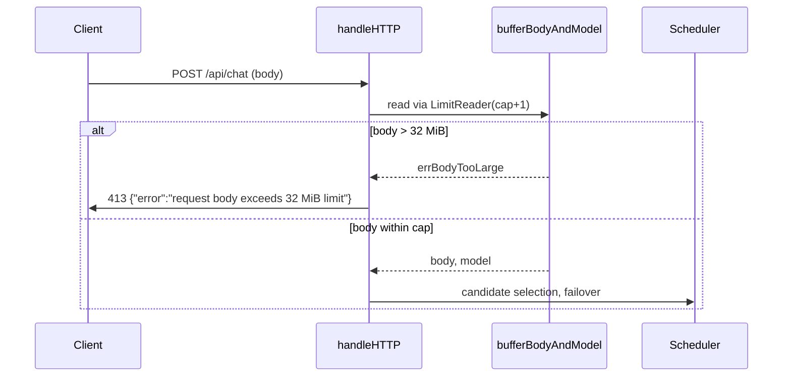
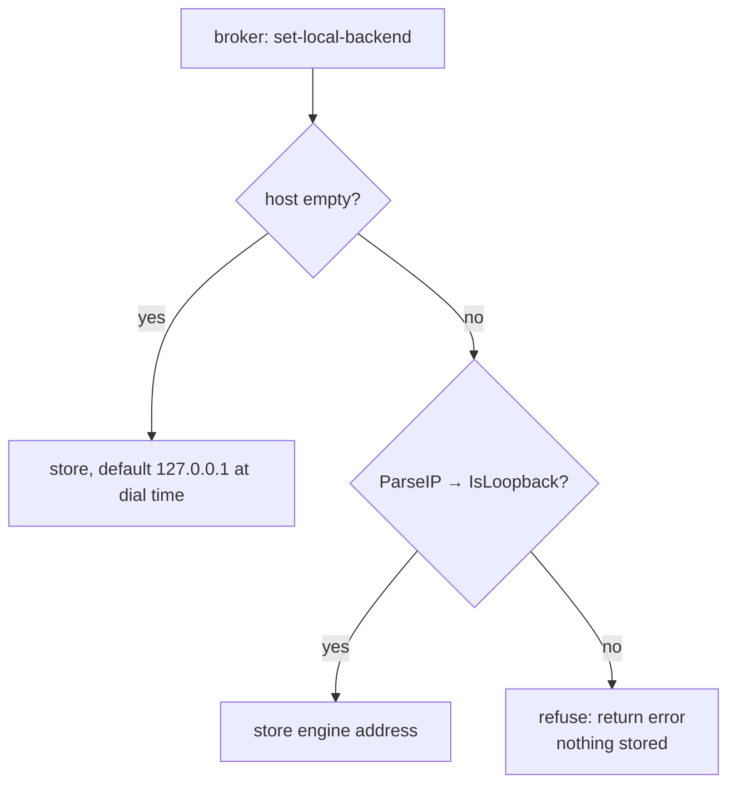
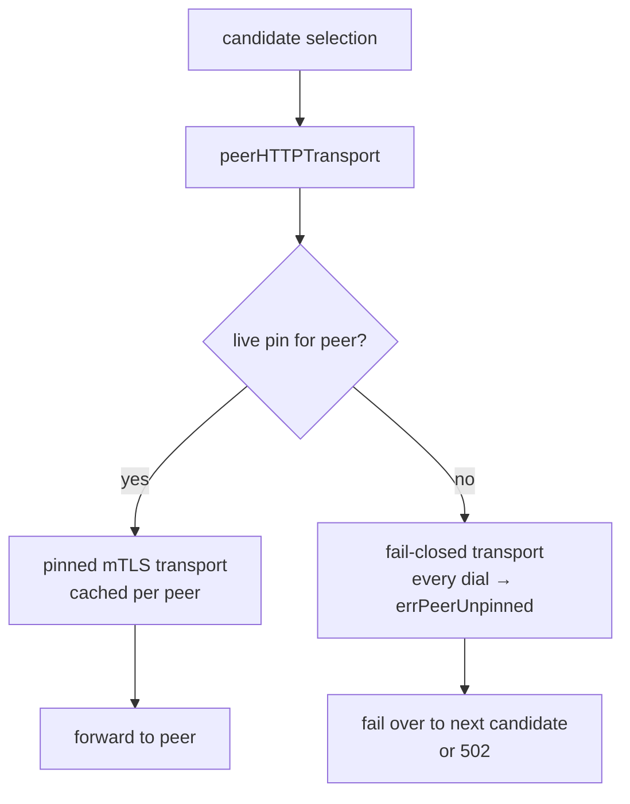

{/*
SPDX-FileCopyrightText: Copyright (c) 2026 NVIDIA CORPORATION & AFFILIATES. All rights reserved.
SPDX-License-Identifier: Apache-2.0
*/}

# Proxy request hardening

The unified `services/nvpair-proxy` hosts one facade per engine behind the
client-facing `ollama-proxy:` / `lmstudio-proxy:` namespaces. Every facade
shares the same request path: a loopback HTTP ingress plus a cluster mTLS
ingress on one port, ordered failover across eligible node candidates, and
model eligibility checks before routing. This document covers three hardening
fixes to that path. Nothing here changes the JSON-RPC surface or the proxy
endpoints clients use.

## 1. Request bodies are capped at 32 MiB

### The problem

`handleHTTP` buffers the entire request body (`io.ReadAll(r.Body)`) so each
failover attempt can replay it. The read was uncapped: any loopback client —
and, given the proxies' permissive loopback CORS posture, any web page the
user visits — could grow the proxy process until it OOMed. No authentication
stands in front of the loopback ingress, so this was remotely triggerable by
anything able to reach the loopback port.

### The fix

`maxInferenceBodyBytes = 32 << 20` caps a single proxied request body.
`bufferBodyAndModel` now reads through `io.LimitReader(r.Body, maxInferenceBodyBytes+1)`:

- Bodies over the cap return `errBodyTooLarge`. `handleHTTP` answers `413`
  with a JSON error **before** candidate selection or any engine work, and
  emits a `proxy/request` notification with the target marked `rejected`.
- Bodies at or under the cap behave exactly as before, including model-field
  extraction for workload tracking.
- Any other read error leaves the partially read bytes in place, as before.

The proxy never holds more than cap+1 bytes per in-flight request body, so a
malicious or buggy client can no longer exhaust proxy memory.

## 2. The local engine address must be loopback

### The problem

The proxy documents a "the host is always loopback" invariant for the local
engine, but the old per-engine `localBackendTarget()` never enforced it: it
built a dial URL from whatever host the broker supplied via
`set-local-backend`. A compromised or buggy broker could have pointed the
cluster mTLS ingress at an arbitrary LAN address, turning the proxy into a
forwarder for plaintext inference traffic to hosts the operator never
approved.

### The fix

The unified ingress enforces the invariant where the engine address is stored:
`setLocalBackend()` in `ingress.go` refuses a non-loopback host outright and
returns an error, so a bad value never reaches the dial path at all.

- A non-loopback host (or an unparseable one — hostnames included) is
  rejected at store time.
- `127.0.0.1`, `::1`, other `127.x` addresses, and the empty default (which
  resolves to `127.0.0.1`) are accepted as before.

The broker always advertises `127.0.0.1` (`nvpair-ui-broker/advertiser.go`),
so legitimate traffic is unaffected; the gate only bites when the supplied
host deviates from the documented invariant.

## 3. Unpinned peers fail closed

### The problem

`peerHTTPTransport()` built the per-peer TLS transport from the cluster's
certificate pin store. When the pin was absent — no cluster mesh, or the pin
vanished between candidate selection and dial time — it returned an **unpinned**
transport. A request could then silently reach the peer over a connection with
no mutual-TLS authentication, exactly in the window where the operator had
reason to believe the peer was gone.

### The fix

The function now returns a fail-closed transport when no live pin exists:

- The transport's `DialContext` always fails with `errPeerUnpinned`; it
  carries no `TLSClientConfig` and never opens a connection.
- Dial errors flow through the existing failover path: the request tries the
  next candidate, or the proxy answers `502` when none remain.

Pins are still dropped from the cache when they disappear
(`dropUnpinnedPeerTransports`); the difference is that a missing pin can no
longer downgrade to an unauthenticated connection in the meantime.

## Validation

- `proxy_hardening_test.go` covers all three fixes: over-cap and at-cap
  bodies, the 413 response shape, loopback/non-loopback engine hosts, and
  the fail-closed dial error. Run with `go test -race ./...` from the
  component directory.
- No JSON-RPC method or payload changed, so no contract regeneration was
  needed.
