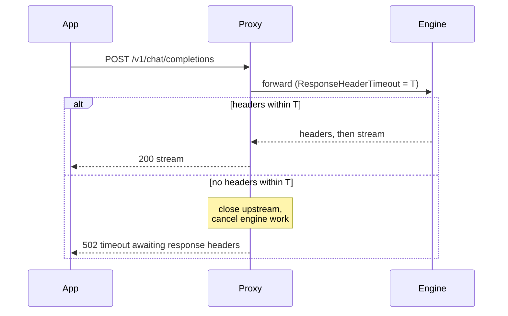

{/*
SPDX-FileCopyrightText: Copyright (c) 2026 NVIDIA CORPORATION & AFFILIATES. All rights reserved.
SPDX-License-Identifier: Apache-2.0
*/}

# Proxy response-header timeout

Both inference proxies (`ollama-proxy`, `lmstudio-proxy`) cap how long they
wait for the upstream engine to send response headers: `ResponseHeaderTimeout`
on the upstream transport. The default is 120 s, and it is now configurable.

## Why the timeout exists, and why 120 s is not always enough

An engine sends no response headers until generation starts. Two normal
situations delay that past 120 s:

- **Queueing.** Ollama serves one request at a time by default
  (`OLLAMA_NUM_PARALLEL=1`). Twenty concurrent requests at ~11 s each means
  the last one waits ~220 s for its turn — every request past the 120 s mark
  fails through PAIR with a 502 while succeeding direct.
- **Cold model loads.** The first request after a model change waits on the
  load before any header is sent.

When the timeout trips, the proxy closes the upstream connection (which also
cancels the engine's queued work) and answers
`502 {"error":"upstream error: net/http: timeout awaiting response headers"}`.



## Configuring it

Precedence is flag, then environment, then the 120 s default:

```bash
ollama-proxy --response-header-timeout 10m
NVPAIR_PROXY_RESPONSE_HEADER_TIMEOUT=10m ollama-proxy
```

The value is a Go duration (`30s`, `5m`, `1h30m`). The broker spawns both
proxies as child processes, so the environment variable set on the broker (or
the desktop app / headless launcher) is inherited — no broker change is
needed. A missing, unparseable, or non-positive value logs a warning and
falls back to 120 s, so a bad setting can never silently disable the timeout.

The effective value is logged at proxy startup (`response_header_timeout`)
for post-mortem analysis.

## Choosing a value

Match it to the worst case you want to survive: queue depth × per-request
time, or the slowest cold load on your hardware. There is no correctness cost
to a generous value — it only bounds how long a request waits on an engine
that never answers. Keep it shorter than any client-side timeout above PAIR
so failures still surface where you expect them.
