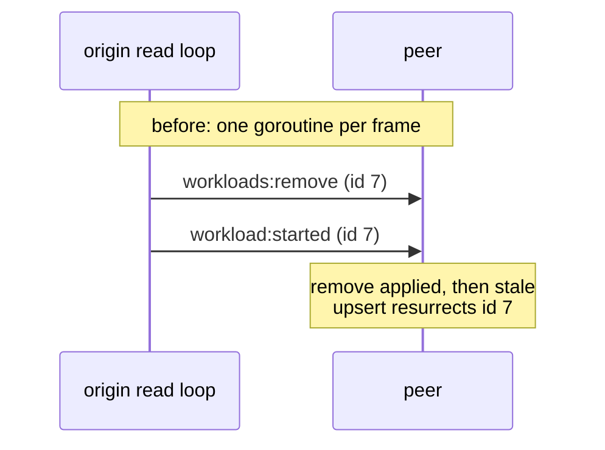
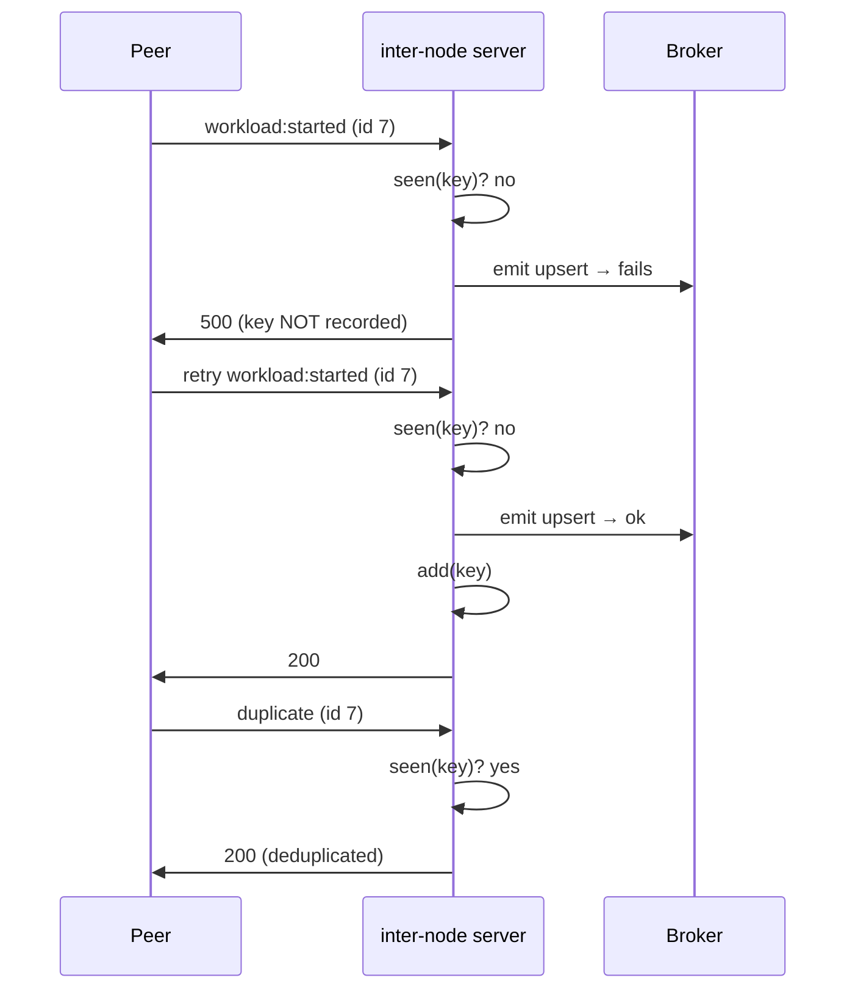

{/*
SPDX-FileCopyrightText: Copyright (c) 2026 NVIDIA CORPORATION & AFFILIATES. All rights reserved.
SPDX-License-Identifier: Apache-2.0
*/}

# Workload broadcast reliability

`services/nvpair-workload-manager` replicates workload lifecycle events to
cluster peers over mutual TLS so every node's scheduler sees the same pending
load. Two ordering bugs in that replication could corrupt a peer's view of the
cluster: ghost workloads that never existed, and real events silently dropped.
Both are fixed here. No JSON-RPC surface changed.

## 1. Broadcasts go out in origin order

### The problem

`broadcastFrame` fanned every outbound frame out in its own goroutine so a
slow peer could never block the read loop. Goroutines are not ordered, so a
`workloads:remove` could overtake the lifecycle upsert it followed. The late
upsert then landed on a peer that had already processed the remove and
**resurrected a ghost workload** — phantom pending load in that peer's
scheduler view, with nothing on the origin to ever correct it.



### The fix

A single ordered worker now drains a bounded queue:

- `broadcastCh` (capacity 1024) is created in `NewManager` and consumed by
  `broadcastLoop`, started in `Run`.
- `broadcastFrame` only enqueues — it still never blocks on network I/O, so a
  slow peer still cannot wedge the read loop.
- A full queue drops the frame with a warning instead of blocking. Frames are
  small JSON notifications, so 1024 is far beyond steady-state volume; during
  a peer outage the heartbeat and discovery backfill re-sync state, and a
  dropped frame degrades to delayed convergence rather than a wedged node.
- At shutdown the loop exits on context cancellation; queued frames are
  dropped with the process.

```mermaid
sequenceDiagram
    participant Origin as origin read loop
    participant Queue as broadcastCh
    participant Worker as broadcastLoop
    participant Peer as peer
    Note over Origin,Peer: after: single ordered consumer
    Origin->>Queue: enqueue workload:started (id 7)
    Origin->>Queue: enqueue workloads:remove (id 7)
    Worker->>Queue: dequeue in order
    Worker->>Peer: workload:started (id 7)
    Worker->>Peer: workloads:remove (id 7)
    Note over Peer: transitions apply in order;<br/>no resurrection
```

## 2. Dedup keys are recorded only after a successful emit

### The problem

The inter-node server deduplicates retried peer events with a key index. The
old code recorded the key **before** emitting to the broker
(`dedup.seenOrAdd`). If the emit failed, the server answered `500` — but the
peer's retry arrived to find the key already recorded and was swallowed as a
duplicate. The event was lost permanently: no anti-entropy repair exists for
it, and the origin had already moved on.

The removal path had the identical flaw: a failed `workloads:remove` emit
meant the retry was deduplicated away and the ghost workload stayed in the
broker catalog.

### The fix

`dedupIndex` split the check from the record: `seen()` reports without
recording, `add()` records. Both `handleLifecycle` and `handleRemove` now
follow the same sequence:

1. If `seen(key)` → answer `200`, skip (genuine duplicate).
2. Emit to the broker. On failure → answer `500` **without** recording the
   key, so the peer's retry is treated as new.
3. On success → `add(key)`.

Resync/backfill frames still bypass dedup, as before — they intentionally
re-assert state so the broker store can reconcile.



A concurrent duplicate that passes `seen()` before either emit runs simply
emits twice; the broker store is idempotent, so the double emit is absorbed.

## Validation

- `reliability_test.go` drives both fixes through the real cluster-mTLS
  broadcast path: 25 frames arrive in exact origin order, and failed
  lifecycle/remove emits return `500` without recording the key — the retry
  emits exactly once, and a genuine duplicate afterwards is still
  deduplicated. Run with `go test -race ./...` from
  `services/nvpair-workload-manager`.
- Component version bumped per `services/VERSIONING.md`:
  `nvpair-workload-manager` 0.13.3 → 0.13.4.
